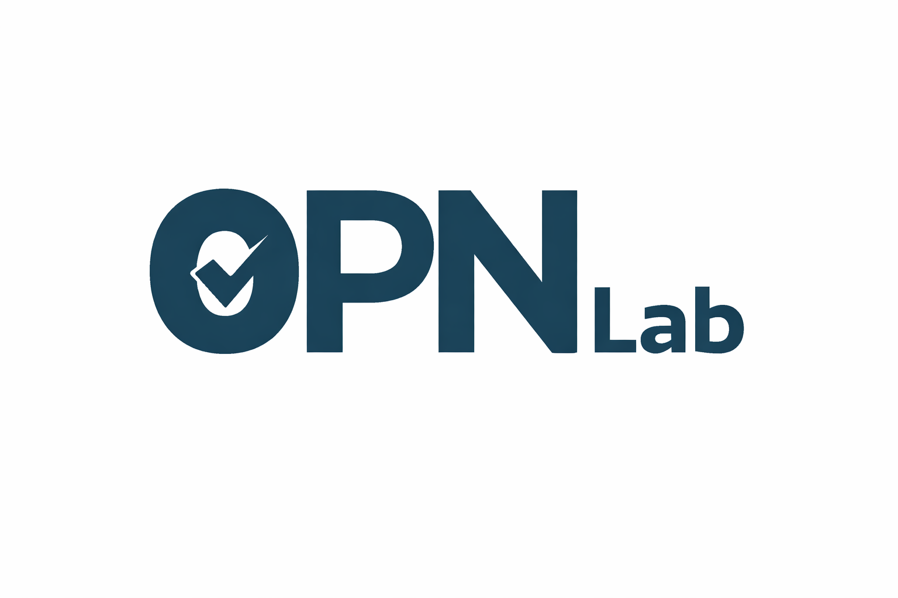

# 0PN Lab Specs

Welcome to the 0PN Lab GitHub, focused on Digital Public Transparency Infrastructure (DPTI).

This repository supports implementing the Convention 108+ Code of Conduct through an extension profile that publishes the 0PN Lab ISO/IEC TS 27560 profile lineage and the consolidated “Digital Consent” packaging, based on the ISO/IEC 27560 consent record information structure.

## How to use this site

- If you want the best overview, start with DCR v1.2.
- If you want the most stable implementer reference, start with UNR v1.01.
- Treat v1.1 as a working draft unless you are participating in a pilot or review.

## Start here

- With the international consent record information structure as the baseline, then each version builds:
    - [ISO/IEC 27560:2023 TS Consent record information structure](iso-27560/)

## UNR prerequisite lineage

- UNR v1.01 — Baseline: [Open UNR v1.01](unr/v1.01/)
- UNR v1 — Submission draft (PDF wrapper): [Open UNR v1](unr/v1/)
- UNR v1.1 — Deferred + enhancement set: [Open UNR v1.1](unr/v1.1/)
- UNR v1.2 — updates to Digital Consent Record (DCR) information sharing (enhancement set): [Open DCR (formally UNR) v1.2](unr/v1.2/)

## ISO-27560 Extension (index)

This directory is the GitHub-facing entrypoint for the ISO-27560 Extension spec package.

Versions

- v1 (submitted baseline): ISO-27560 Extension /v 1/
- v1.01: ISO-27560 Extension /v 1.01/
- v1.02 (delegation baseline uplift): ISO-27560 Extension /v 1.02/[index.md](http://index.md)
- v1.1: ISO-27560 Extension /v 1.1/
- v1.2: ISO-27560 Extension /v 1.2/
- v1.2.1: ISO-27560 Extension /v 1.2.1/

## Governance / updates (non-normative context)

- [0PN Policy WG posts](https://lab.0pn.org/tag/0pn-policy-wg/)

## License

- [License](https://github.com/0PN-lab/specs/blob/main/LICENSE)